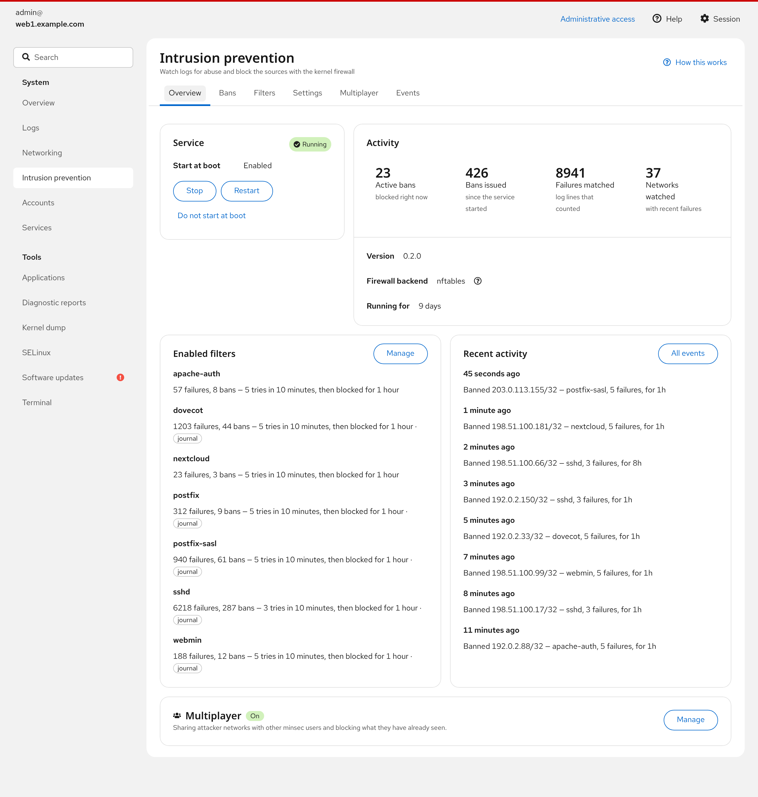
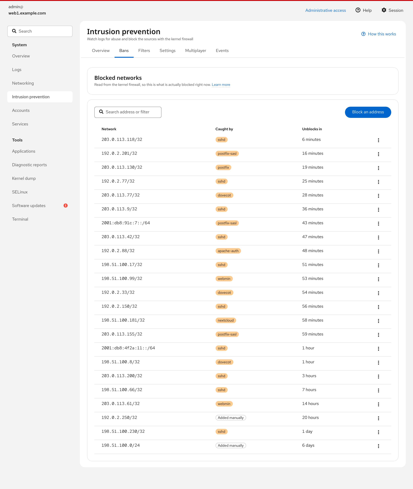
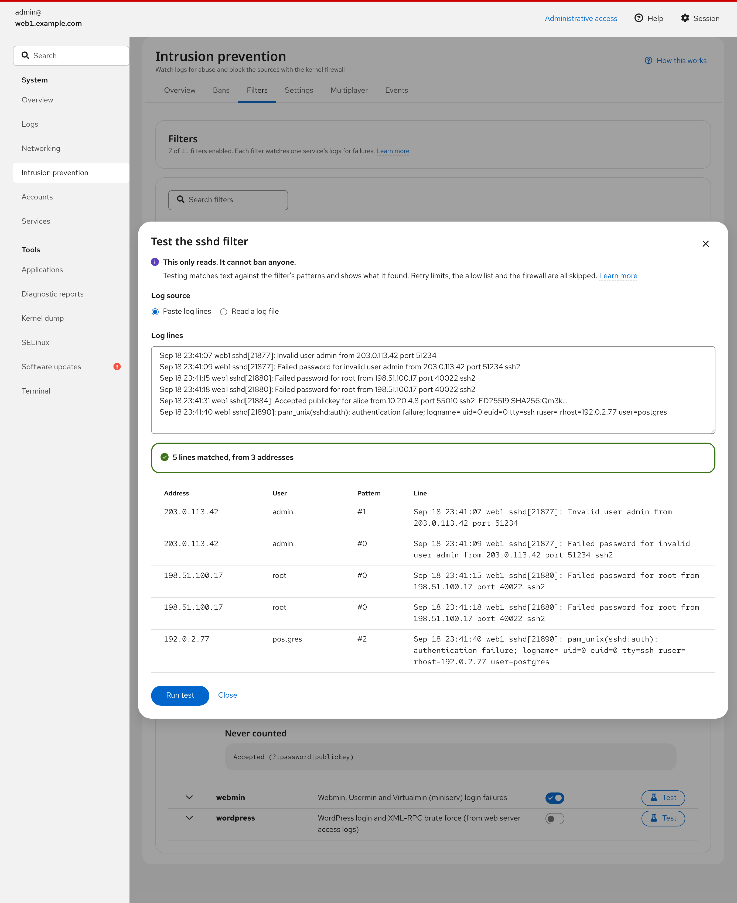
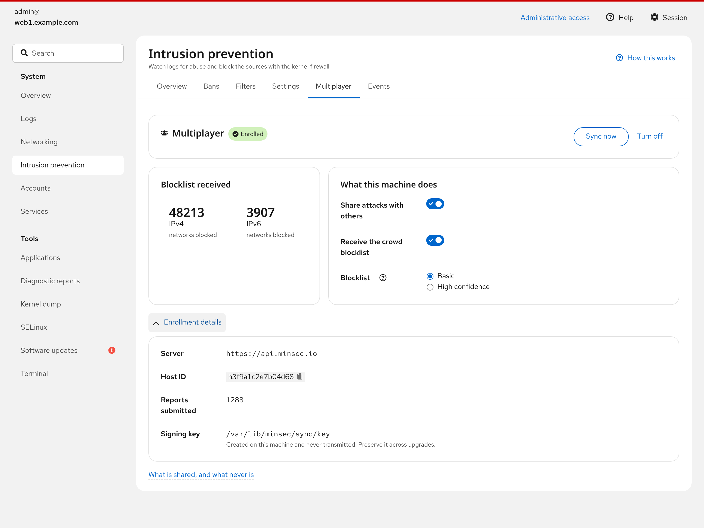

# cockpit-minsec

A [Cockpit](https://cockpit-project.org/) page for
[minsec](https://github.com/minsecio/minsec), a small log-driven intrusion
prevention daemon.

It gives minsec a web interface on any machine running Cockpit: what's
blocked right now, which filters are watching which logs, and why each ban
happened — plus the controls to change all of it, and inline guidance drawn
from minsec's manual pages so the answer is on the page rather than in
`man minsec.toml`.

## At a glance

Screenshots use invented data on a private test machine.

<picture>
  <source media="(prefers-color-scheme: dark)" srcset="screenshots/dark/01-overview.png">
  
</picture>

<picture>
  <source media="(prefers-color-scheme: dark)" srcset="screenshots/dark/03-bans.png">
  
</picture>

<picture>
  <source media="(prefers-color-scheme: dark)" srcset="screenshots/dark/06-filters-test.png">
  
</picture>

<picture>
  <source media="(prefers-color-scheme: dark)" srcset="screenshots/dark/09-multiplayer.png">
  
</picture>

## What it does

| Page | |
|---|---|
| **Overview** | Service state and controls, live counters, enabled filters, recent activity, and multiplayer status. Warns when minsec is running but watching nothing, or when the backend is set to observe only. |
| **Bans** | Active bans read from the kernel, with the filter that caused it and its remaining lifetime. Block and unblock addresses or CIDRs by hand. |
| **Filters** | Every built-in and custom filter with its patterns, log sources and effective policy. Enable or disable each one, and **test a filter against pasted log lines or a real log file** before turning it on. |
| **Settings** | Guided editing of ban time, find time, retry limit, escalation, the allow list, the firewall backend and IPv6 aggregation — with a plain-language summary of what the policy actually means. Also edits the raw configuration files and custom filter definitions. |
| **Multiplayer** | Opt in to crowd-sourced blocking. Shows enrollment, the size of the downloaded blocklist, and what is and will be sent. |
| **Events** | The daemon's event log: ban, unban, start and stop. |

Changes are validated with `minsec check` before accepting, and the
page never leaves the service in a state where it would refuse to start
without saying so.

## Requirements

* Cockpit 266 or newer (`cockpit-bridge`)
* `minsec` for everything except the multiplayer page
* `minsec-sync` for the multiplayer page

The page degrades rather than breaking: if minsec is not installed, is not
running, or `minsec-sync` is absent, it says so and explains what is missing.
Administrative access is required for anything privileged, because minsec's
control socket is restricted to the `minsec` group; without it the page is
read-only.

## Install

From a package:

```sh
dnf install cockpit-minsec     # or: apt install cockpit-minsec
```

From source:

```sh
make && sudo make install
```

## Development

```sh
make devel-install    # build and symlink into ~/.local/share/cockpit
make watch            # rebuild on change
make check            # build, then run the test suite
```

`devel-install` links the build into your own Cockpit package path, so a
rebuild is picked up by reloading the browser. Remove it with
`make devel-uninstall`.

The stack is the Cockpit
[starter-kit](https://github.com/cockpit-project/starter-kit) standard:
React 18, PatternFly 6 and esbuild. There is no build step at runtime; the
package is static files served by `cockpit-ws`.

### How it talks to minsec

Every minsec subcommand accepts `--json`, so nothing here scrapes
human-readable output. `src/minsec.js` is the entire integration surface:

* `minsec --json status|list|filters|events|inspect|check|test` via
  `cockpit.spawn`, with `superuser: "require"` for the commands that need the
  control socket.
* `minsec-sync` has no `--json`, so its state is read from the files it
  documents — `/etc/minsec/sync.toml` and
  `/var/lib/minsec/sync/state.json` — rather than by parsing its output.
* `systemctl show` for unit state, in one call per unit.

Settings written by the guided form go to
`/etc/minsec/conf.d/zz-cockpit.toml` rather than rewriting a hand-maintained
`minsec.toml`. Drop-ins are merged in lexical order and that name sorts last,
so what the form shows is what takes effect.

minsec does not reload configuration while running, so anything that writes
configuration raises a persistent banner offering a validated restart.

`test/run.js` bundles the client modules against a stub `cockpit` global and
covers duration and network parsing, TOML generation, and the spawn error
paths. The stub reproduces cockpit's two-argument rejection — `cockpit.spawn`
rejects with `(error, stdout)`, and `await` binds only the first — because
that detail is what lets `minsec check` report *which* filter is broken when
the command exits non-zero.

## Packaging

```sh
make dist     # source tarball, with dist/ prebuilt
make rpm      # needs rpm-build
make deb      # needs dpkg-dev and debhelper
```

The tarball ships the built `dist/` so distribution builds don't need npm
or network access, and `src/` so the package remains buildable from source.

## License

GPL-3.0-or-later or LGPL-2.1-or-later.

`src/lib/superuser.js` and `src/lib/cockpit-dark-theme.js` are taken from the Cockpit project and are
LGPL-2.1-or-later; see `debian/copyright`.
